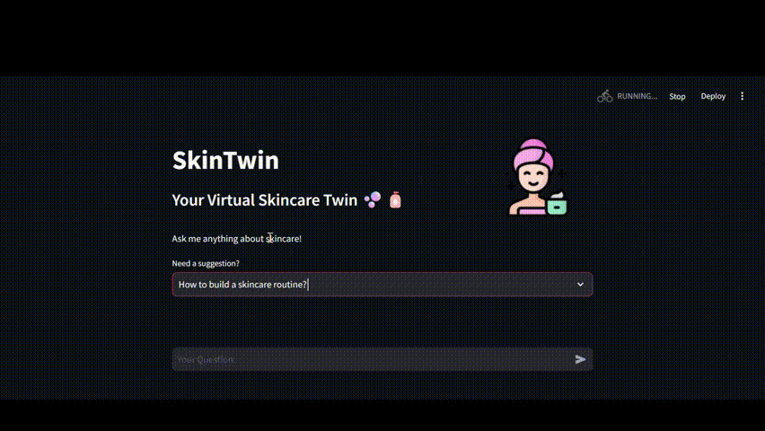

# **SkinTwin - Your Virtual Skincare Twin**  

##DEMO

## **Table of Contents**  
- [Overview](#overview)  
- [Features](#features)  
- [Tech Stack](#tech-stack)  
- [Setup Instructions](#setup-instructions)  
- [Project Structure](#project-structure)  
- [Future Enhancements](#future-enhancements)  
- [Contributing](#contributing)  
- [License](#license)  

---

## **Overview**  
**SkinTwin** is an AI-powered chatbot designed to provide personalized skincare advice. It helps users build skincare routines, recommend products, and find solutions for common skin concerns.  

Users can chat with **SkinTwin** to receive expert recommendations on skincare products, treatments for acne, sun protection, and more!  

---

## **Features**  
✅ **Chatbot for Skincare Advice** – Get instant skincare recommendations based on AI analysis.  
✅ **AI-Powered Responses** – Uses NLP and deep learning for intelligent replies.  
✅ **Suggested Queries** – Provides pre-set skincare-related questions for quick help.  
✅ **Interactive Streamlit UI** – Clean and user-friendly interface.  
✅ **Deep Learning Integration** – Utilizes trained models for accurate responses.  
✅ **Secure & Fast** – Ensures user-friendly and efficient interaction.  

---

## **Tech Stack**  
- **Python** – Core logic and backend processing.  
- **Streamlit** – Frontend UI for chatbot interaction.  
- **TensorFlow/Keras** – Machine learning model for text classification.  
- **Scikit-learn** – Label encoding and NLP preprocessing.  
- **JSON** – Intent storage for chatbot responses.  

---

## **Setup Instructions**  

### **1. Clone the Repository**  
git clone https://github.com/yourusername/SkinTwin.git
cd SkinTwin
### **2. Install Dependencies**
pip install -r requirements.txt
### **3. Run the Application**
streamlit run chatbot.py

### **Future Enhancements**
🚀 Voice Input – Allow users to ask questions using voice commands.
🚀 Product Recommendations – Suggest skincare products based on skin type.
🚀 AI Skin Analysis – Analyze user-uploaded images for skincare insights.
🚀 Chat History – Save previous chats for better skincare tracking.

### *Contributing*
We welcome contributions! If you’d like to improve SkinTwin, follow these steps:
Fork the repository
Make your changes
Submit a pull request
Your contributions help make SkinTwin better for everyone!

